# ShortLink Architecture

## System Overview

```mermaid
graph TB
    Client[🌐 Client<br/>Browser/Apps] --> Traefik[⚖️ Load Balancer<br/>Traefik]
    Traefik --> API[🚀 ShortLink.WebAPI<br/>ASP.NET Core API]
    
    subgraph "🎯 Presentation Layer"
        API --> Controllers[📋 Controllers<br/>• LinksController<br/>• StatsController]
        API --> Middleware[🔧 Middleware<br/>• RedirectMiddleware<br/>• ExceptionHandling]
        API --> Extensions[⚙️ Extensions<br/>• Service Registration<br/>• Configuration]
    end
    
    Controllers --> Application[🎪 ShortLink.Application<br/>CQRS Layer]
    Middleware --> Application
    
    subgraph "🎪 Application Layer"
        Application --> Commands[📝 Commands<br/>• CreateLinkCommand<br/>• RedirectLinkCommand]
        Application --> Queries[🔍 Queries<br/>• GetLinkByCodeQuery<br/>• GetRecentLinksQuery]
        Application --> DTOs[📦 DTOs<br/>• LinkDto<br/>• AppSettings]
    end
    
    Commands --> Domain[💎 ShortLink.Domain<br/>Business Logic]
    Queries --> Domain
    
    subgraph "💎 Domain Layer"
        Domain --> Entities[🏛️ Entities<br/>• Link]
        Domain --> ValueObjects[💰 Value Objects<br/>• ShortCode]
        Domain --> Interfaces[🔌 Interfaces<br/>• ILinkRepository<br/>• ILinkCache]
    end
    
    Entities --> Infrastructure[🔧 ShortLink.Infrastructure<br/>Data & Services]
    Interfaces --> Infrastructure
    
    subgraph "🔧 Infrastructure Layer"
        Infrastructure --> Repositories[🗄️ Repositories<br/>• LinkRepository<br/>• UnitOfWork]
        Infrastructure --> Cache[⚡ Cache<br/>• RedisCacheService<br/>• RedisOptions]
        Infrastructure --> Services[🛠️ Services<br/>• ShortCodeGenerator<br/>• External Services]
    end
    
    subgraph "💾 Data Layer"
        Repositories --> SqlServer[(🗃️ SQL Server<br/>Entity Framework)]
        Cache --> Redis[(⚡ Redis<br/>Cache & Stats)]
        Services --> HealthChecks[❤️ Health Checks<br/>DB + Redis Status]
    end
    
    style Client fill:#e1f5fe
    style API fill:#f3e5f5
    style Application fill:#fff3e0
    style Domain fill:#e8f5e8
    style Infrastructure fill:#fce4ec
    style SqlServer fill:#fff8e1
    style Redis fill:#ffebee
```

## Data Flow Diagrams

### 1. Create Short Link Flow

```mermaid
sequenceDiagram
    participant C as 🌐 Client
    participant API as 🚀 WebAPI
    participant CMD as 📝 CreateLinkCommand
    participant H as 🎯 Handler
    participant D as 💎 Domain
    participant R as 🗄️ Repository
    participant DB as 🗃️ Database
    participant Cache as ⚡ Redis

    C->>API: POST /api/links
    API->>CMD: CreateLinkCommand
    CMD->>H: Handle(command)
    H->>D: Link.Create()
    D->>R: SaveAsync()
    R->>DB: INSERT Link
    R->>Cache: Cache original URL
    DB-->>R: Link saved
    Cache-->>R: Cached
    R-->>H: Success
    H-->>CMD: LinkDto
    CMD-->>API: Response
    API-->>C: 201 Created + Short URL
```

### 2. Redirect Short Link Flow

```mermaid
sequenceDiagram
    participant C as 🌐 Client
    participant M as 🔧 RedirectMiddleware  
    participant Cache as ⚡ Redis
    participant R as 🗄️ Repository
    participant DB as 🗃️ Database

    C->>M: GET /{shortCode}
    M->>Cache: Get original URL
    
    alt Cache Hit
        Cache-->>M: Original URL
        M->>Cache: Increment click count
        M-->>C: 302 Redirect
    else Cache Miss
        Cache-->>M: Not found
        M->>R: GetByCodeAsync()
        R->>DB: SELECT Link
        DB-->>R: Link data
        R-->>M: Link entity
        M->>Cache: Cache URL + metadata
        M->>Cache: Increment click count
        M-->>C: 302 Redirect
    end
```

### 3. Get Statistics Flow

```mermaid
sequenceDiagram
    participant C as 🌐 Client
    participant API as 🚀 StatsController
    participant Cache as ⚡ Redis
    participant R as 🗄️ Repository
    participant DB as 🗃️ Database

    C->>API: GET /api/stats/{code}
    API->>Cache: Get click count
    Cache-->>API: Click statistics
    API->>R: GetByCodeAsync()
    R->>DB: SELECT Link details
    DB-->>R: Link metadata
    R-->>API: Link entity
    API-->>C: Combined statistics JSON
```

## Key Components

### Clean Architecture Layers
- **Presentation**: WebAPI Controllers, Middleware
- **Application**: CQRS Commands/Queries, Handlers
- **Domain**: Entities, Value Objects, Business Rules
- **Infrastructure**: Repositories, External Services, Cache

### CQRS Pattern
- **Commands**: CreateLink, RedirectLink (write operations)
- **Queries**: GetLinkByCode, GetRecentLinks (read operations)
- **Handlers**: Process commands/queries independently

### Caching Strategy
- **Redis**: Primary cache for performance
- **Keys**: Prefixed with "shortlink:"
- **TTL**: Configurable expiration times
- **Fallback**: Database when cache misses

### Middleware Pipeline
1. **Exception Handling**: Global error management
2. **Redirect**: Short URL processing
3. **CORS**: Cross-origin request handling
4. **Routing**: API endpoint resolution

## Technology Stack

### Backend
- **.NET 10**: Runtime and framework
- **ASP.NET Core**: Web API framework
- **Entity Framework Core**: ORM for database
- **Redis**: Caching and session storage

### Database
- **SQL Server**: Primary data storage
- **Entity Framework Migrations**: Schema management

### DevOps
- **Docker**: Containerization
- **Docker Compose**: Multi-container orchestration
- **Traefik**: Load balancing and reverse proxy

### Development
- **Clean Architecture**: Separation of concerns
- **CQRS**: Command Query Responsibility Segregation
- **Repository Pattern**: Data access abstraction
- **Dependency Injection**: Inversion of control